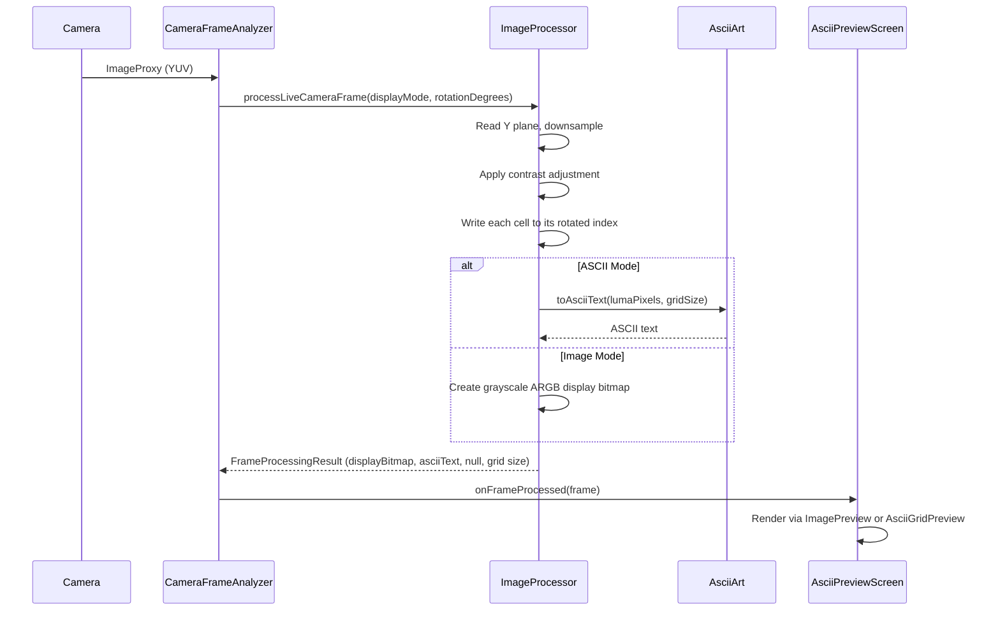
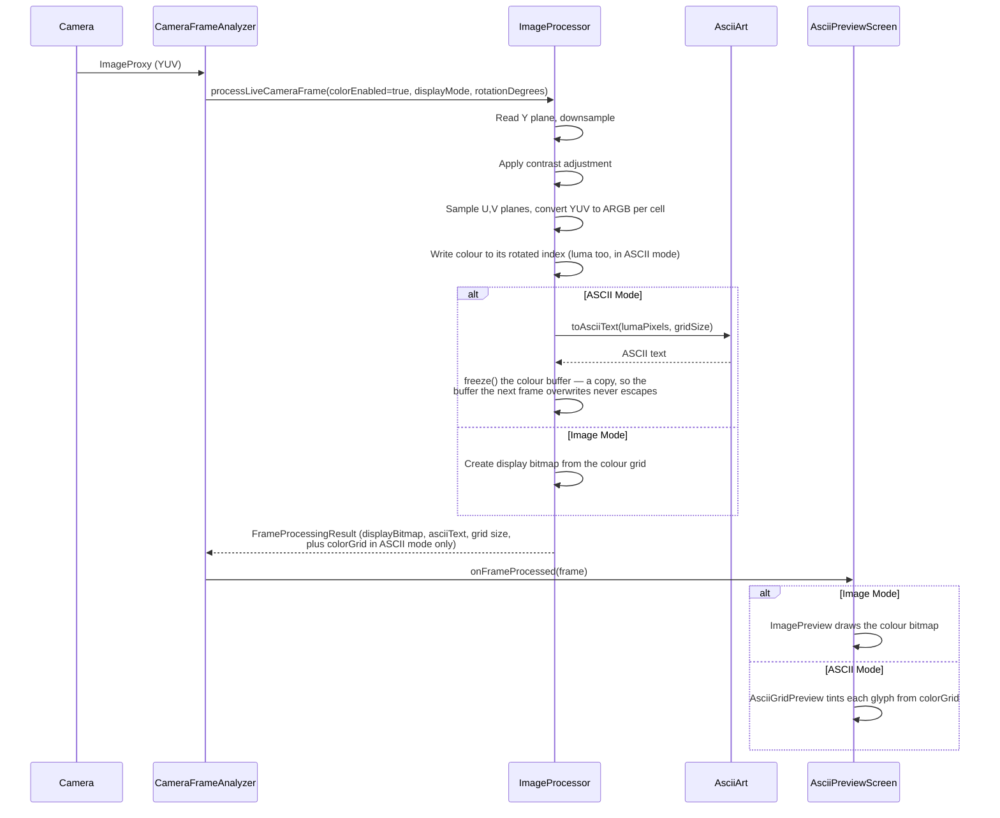
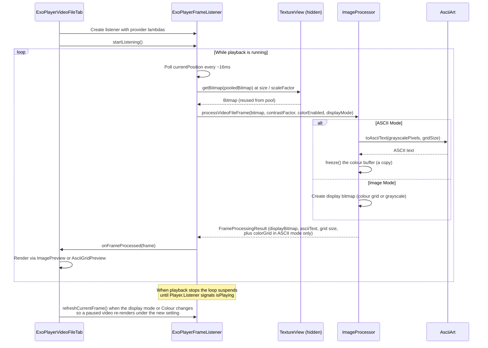
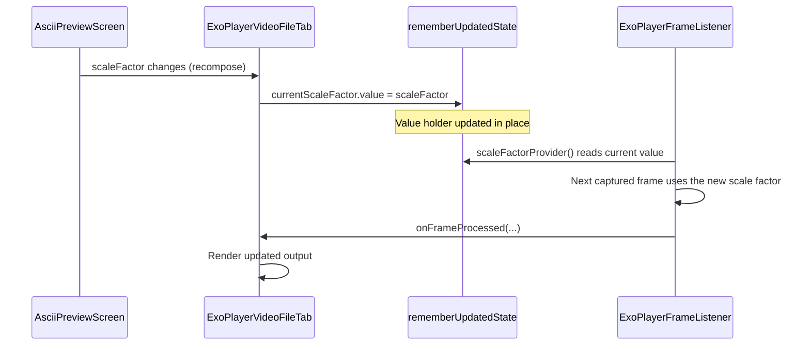
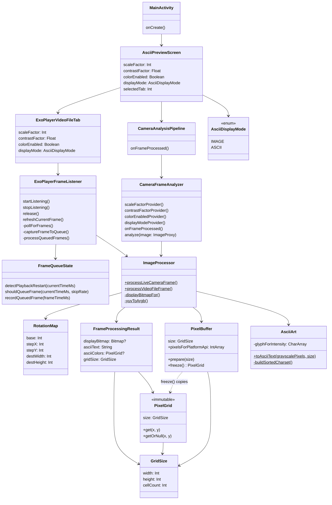

# ASCII Art

## What this app does
This Android app provides two input sources for real-time ASCII art generation:

### Live Camera Tab
Takes live camera input, downsamples it into a coarse grid, and renders that grid as either:
- a de-res image (`Image` mode), or
- ASCII art (`ASCII` mode).

### Video File Tab
Loads video files from device storage and applies the same pipeline in real-time, in both `Image` and `ASCII` mode.

Both tabs support a **Colour** toggle:
- **Off:** output is grayscale-based.
- **On:** each de-res cell is assigned a sampled color, and ASCII glyphs (and Image mode cells) use that color.

## Screenshots

| Live Camera Tab | Video File Tab |
|---|---|
| ![Live Camera tab showing ASCII art output from the device camera][screenshot-live] | ![Video File tab showing the Load, Restart, Play and Pause control bar with ASCII art output from a video file][screenshot-video] |

[screenshot-live]: docs/screenshot_live_camera.png
[screenshot-video]: docs/screenshot_video_file.png

## Documentation

### Pipeline Visualizations
| Diagram | Description |
|---|---|
| [Grayscale Pipeline Flowchart](docs/pipeline-grayscale-flow.png) · ([.mmd source](docs/pipeline-grayscale-flow.mmd)) | End-to-end flowchart of the live camera grayscale pipeline, from `YUV_420_888` capture through to Compose display. |
| [Pixel Journey — data transformation](docs/pipeline-grayscale-pixel-journey.svg) | Step-by-step illustrated walkthrough showing how a single frame's pixel values change at each stage: Y-plane extraction, downsampling, contrast LUT, ARGB packing, and the IMAGE / ASCII output split. |

### Architecture Diagram Renders
Standalone PNG renders of the diagrams embedded in the [Architecture Diagrams](#architecture-diagrams) section below.

| Diagram | File |
|---|---|
| Grayscale Mode Sequence | [sequence-grayscale.png](docs/sequence-grayscale.png) · [.mmd](docs/sequence-grayscale.mmd) |
| Colour Mode Sequence | [sequence-colour.png](docs/sequence-colour.png) · [.mmd](docs/sequence-colour.mmd) |
| Video File Sequence | [sequence-video-file.png](docs/sequence-video-file.png) · [.mmd](docs/sequence-video-file.mmd) |
| Static Class Diagram | [class-diagram.png](docs/class-diagram.png) · [.mmd](docs/class-diagram.mmd) |

### Analysis & Notes
| Document | Description |
|---|---|
| [Code Review — Aug 2026](docs/code-review-2026-08-04.md) | Full code review covering architecture, performance, correctness, and test coverage. |
| [Development Recommendations](docs/development-recommendations.md) | Prioritised list of recommended improvements to the codebase. |
| [FPS Improvement Suggestions](docs/fps-improvement-suggestions.md) | Targeted suggestions for improving frame throughput in both the live camera and video file pipelines. |

## Why this was created
This project was created as an exploration of **GitHub Copilot’s capability** to iteratively design, implement, debug, and refine a non-trivial real-time graphics pipeline in an Android app.

## High-level graphics pipeline

### Live Camera Pipeline
1. Acquire camera frames with CameraX `ImageAnalysis` using `KEEP_ONLY_LATEST`.
2. Read luma (Y) and downsample according to user scale factor.
3. Apply contrast adjustment to luma values before output mapping.
4. Write each cell straight to its rotated destination index, so the grid already matches device
   orientation when the loop ends — there is no separate rotation pass.
5. Build:
   - a grayscale de-res bitmap, and
   - (when Colour is enabled) a per-cell ARGB color grid sampled from YUV.
6. Render either image cells or ASCII cells in Compose.

### Video File Pipeline
1. Load video file using ExoPlayer 2.19.1.
2. While playback is running, poll the playback position at ~60Hz to detect new frames. The loop
   suspends when playback stops and is woken by a `Player.Listener`, so an idle or paused tab costs
   nothing.
3. Extract frames via `TextureView.getBitmap()` from a hidden zero-alpha `TextureView` that ExoPlayer
   renders to. Bitmaps are reused from a pool (`ConcurrentLinkedQueue`) to eliminate per-frame
   allocation.
4. Process frames through the same pipeline as live camera:
   - Downsample according to scale factor (applied at capture, via the requested bitmap size)
   - Apply contrast adjustment
   - Generate grayscale bitmap and optional color grid
5. Render the processed grid in both `Image` and `ASCII` mode, with real-time parameter
   responsiveness. Only the ASCII text conversion is mode-dependent.

## ASCII mapping algorithm
For each de-res cell:
1. Use the cell grayscale intensity (0..255).
2. Map the intensity directly onto an index in the density-sorted printable ASCII character list, which runs from sparsest to densest: `index = intensity * (charCount - 1) / 255`.
3. Because the list ascends in density, bright areas of the scene reach the dense end (e.g. `@`, `#`) and dark areas stay near the sparse end (e.g. `.`, space) — which is correct for the white-on-black display, where ink means light. Do **not** invert the intensity to `255 - intensity`: that blanks out the bright parts of the scene and inks the dark ones.
4. Render the selected character at the corresponding on-screen cell bounds.

Character choice logic does **not** change when Colour is enabled; colour is applied as an additional rendering layer.

Because intensity is a single byte, the whole mapping is only 256 distinct answers. It is
precomputed once into a `CharArray(256)` and the per-pixel work is a single array read.

## Character density model
Character density is computed by rasterizing each candidate printable ASCII character into a fixed one-character bitmap grid and measuring occupancy:

`density = lit_pixels / total_pixels`

Characters are sorted by this density, from sparse (e.g. space) to dense. Grayscale intensity is then mapped across that ordered list.

## Current controls
- **Scale factor** slider: controls downsampling resolution (2–48×).
- **Contrast** slider: adjusts contrast before mapping.
- **Mode chips**: `Image` / `ASCII` (radio group, shared across both tabs).
- **Colour** toggle: enables per-cell color output (affects both Live Camera and Video File).
- **Tab selector**: switch between Live Camera and Video File input sources.

## Notes
- App is portrait-locked.
- Edge-to-edge/system bar transparency is configured.
- Camera permission is requested at runtime.
- Video files are chosen through the system file picker, which opens in `/sdcard/Download/` — any location the picker can reach will work.
- Scale factor and contrast adjustments update in real-time on both tabs.
- Colour toggle applies dynamically (no need to restart video playback).

## Architecture Diagrams

### Grayscale Mode Sequence

### Colour Mode Sequence

### Video File Processing Sequence

### Shared Parameter Update Flow

### Static Class Diagram

| Class | Description |
|---|---|
| `MainActivity` | The app's single Android `Activity`. Configures edge-to-edge / transparent system bar styling and hosts the root Compose content via `setContent`. |
| `AsciiPreviewScreen` | Root composable screen. Owns all shared UI state — scale factor, contrast, colour toggle, display mode and selected tab — and renders the control panel plus the tab selector. |
| `CameraAnalysisPipeline` | Private composable that wires up CameraX `ImageAnalysis`, binds it to the `LifecycleOwner`, and forwards each raw camera frame to a `CameraFrameAnalyzer` instance. |
| `CameraFrameAnalyzer` | Implements `ImageAnalysis.Analyzer`. Receives raw YUV `ImageProxy` frames from CameraX, passes the sensor rotation and the current display mode through to `ImageProcessor` (which applies the rotation while downsampling), and posts the finished `FrameProcessingResult` to the UI thread. |
| `ImageProcessor` | Singleton. Downsamples luma data from a YUV `ImageProxy` or an existing `Bitmap`, applies contrast adjustment, and produces exactly what the current display mode draws — see `FrameProcessingResult`. Applies rotation inside the downsample loop via `RotationMap`. Writes into four `PixelBuffer`s it owns, two per pipeline; anything the UI keeps leaves through `freeze()`. |
| `RotationMap` | A right-angle rotation expressed as an affine index map — `dstIndex = base + stepX * x + stepY * y` — so the downsample loop can write each cell directly to its rotated position. Pure arithmetic with no Android dependency, which is what makes it unit-testable. |
| `FrameProcessingResult` | Immutable data class that carries the output of a single `ImageProcessor` call: the `GridSize`, the ASCII text for ASCII mode, an optional `PixelGrid` of per-cell ARGB colours, and the `Bitmap` Image mode draws — null in ASCII mode, which draws no image. Building only what the mode shows is what keeps a full-size bitmap from being allocated and filled on every frame regardless of whether anything reads it. |
| `GridSize` | The dimensions of a de-res grid, in cells. Carried separately from the pixels because it outlives them: with Colour off there is no colour grid, and the UI still has to lay out cells. |
| `PixelGrid` | An immutable grid of ARGB pixels — the only pixel type that may cross to the main thread and be held in Compose state. Its array is private and its constructor internal, so the sole way to obtain one is `PixelBuffer.freeze()`, which copies. |
| `PixelBuffer` | A reusable pixel buffer owned by `ImageProcessor` and overwritten by every frame. Grown, never shrunk, so it can be longer than the current grid. Passing one to a function that reads and returns is safe; anything that outlives the call must go through `freeze()` first. Splitting these two types apart is what makes the mistake behind item 4 — a reused buffer escaping to Compose state — a type error rather than a race. |
| `AsciiArt` | Singleton. Converts a grid of grayscale pixels to a multi-line ASCII `String` by mapping each pixel's intensity to a character from a density-sorted printable ASCII set — brighter cells map to denser glyphs. The mapping is precomputed into a `CharArray(256)` on first use, so the per-pixel cost is one array read. |
| `AsciiDisplayMode` | Enum with two values — `IMAGE` (render de-res bitmap cells) and `ASCII` (render character glyphs) — shared across both tabs. |
| `ExoPlayerVideoFileTab` | Composable for the Video File tab. Creates and manages the `ExoPlayer` instance and its lifecycle. Provides a persistent control bar (Load, Restart, Play, Pause) visible in both modes. Delegates frame capture to `ExoPlayerFrameListener` and renders the output through `ImagePreview` or `AsciiGridPreview`. |
| `ExoPlayerFrameListener` | Bridges ExoPlayer playback and the de-res pipeline. Polls the player position at ~60 Hz on the main thread while playback runs, captures rendered frames via `TextureView.getBitmap()` into a `Channel<Bitmap>`, and processes them on an IO thread via `ImageProcessor`. Suspends its poll loop when playback stops, and re-captures the displayed frame on demand so a paused video still follows a display mode change. |
| `FrameQueueState` | Frame-timing state for the video pipeline, kept separate from the coroutine plumbing so it can be unit-tested: enforces a minimum gap between captures, applies the frame-skip rate, and detects backward seeks or loops. |
